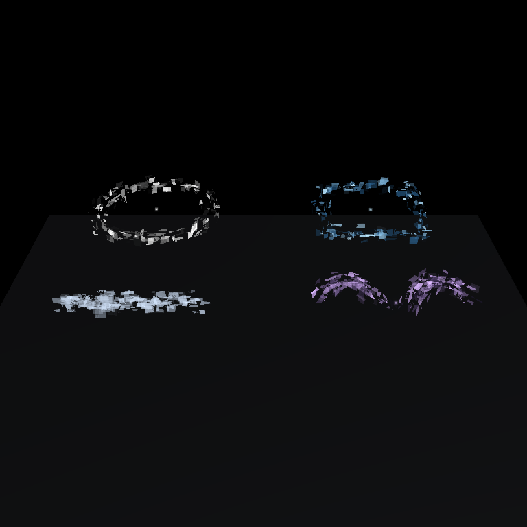
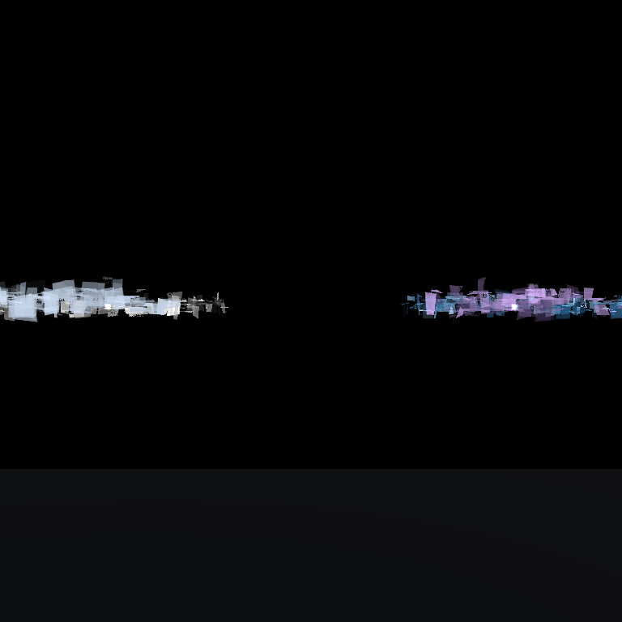

# Digital Halo / Geometry Block Effect 使用ガイド

`io.github.sabas0ba.sabaaccessory.digital-halo` は、円周などの point cloud を Geometry Shader に渡し、時間変化する Rect を生成する PC Avatar 向け VPM package です。完全なトーラス mesh やテクスチャは使用しません。

## 概要

- Circle、Quad、Line、Wing の4形状を生成
- 水平・垂直 Rect の出現率、重複数、サイズ、変位を Material から設定
- World 座標を基準としたグリッチ、歪み、かすれ、欠落ノイズ
- モノクロ、固定パレット、単色、色範囲の4種類の Color Mode
- 各 shape の point cloud から短寿命のブロック Particle を生成
- 実行時 MonoBehaviour とテクスチャは不使用

## 動作環境

| 項目 | 対応範囲 |
| --- | --- |
| Unity | 2022.3 |
| VRChat SDK | Avatars SDK 3.10.x |
| Avatar platform | PC |
| Package manager | VCC または ALCOM |

Geometry Shader を使用するため Android/Quest Avatar では動作しません。

## 導入

1. VCC または ALCOM に `https://sabas0ba.github.io/vrc_sabaaccessory/index.json` を repository として追加します。
2. 対象の Avatar project を開きます。
3. `SabaAccessory Digital Halo` package を追加します。
4. Unity で Avatar project を開き、Generator または Demo Scene を使用します。

既存の package を更新する場合は、VCC / ALCOM 上で対象 project の package version を確認してから更新してください。

## Demo Scene

`Tools > SabaAccessory > Digital Halo > Import and Open Demo Scene` で Sample を取り込みます。`DigitalHaloDemo.unity` には人体 Mesh を置かず、次の4形状を配置しています。

| Object | Shape | 初期 Color Mode |
| --- | --- | --- |
| Circle Effect | Circle | Monochrome |
| Quad Effect | Quad | Fixed Palette / Cold Steel |
| Line Effect | Line | Single Color |
| Wing Effect | Wing | Color Range |

水平 Rect は地面と平行、垂直 Rect は接線方向と World Y で構成されます。そのため、真横からは垂直 Rect が輪郭を維持します。

Play Mode では Rect と `Block Noise Particles` の出現状態が変化します。Particle は各 shape の point cloud 頂点から発生し、初期値は Lifetime 0.24–0.82秒、Emission 42 particles/sec、最大120個です。

## Generator

1. Avatar の Head bone または任意の親 Transform を選択します。
2. `Tools > SabaAccessory > Digital Halo Generator` を開きます。
3. `Shape`、`Size`、`Radial Span`、`Source Points`、`Height Offset` を設定します。
4. `Create Digital Halo` を押します。

生成 Object は選択中 Transform の子になります。Halo の rotation は identity で、水平 Rect は World XZ 平面に生成されます。生成物は `Assets/SabaAccessory/Generated/` に保存され、Object には MeshFilter、MeshRenderer、子 Particle System が配置されます。

## Color Mode

Material の `Color Mode` で4種類を選択します。

- `Monochrome`: `Monochrome Lower` から白までの輝度補間
- `Fixed Palette`: `Fixed Palette` の Neutral、Cold Steel、Amber、Violet、Terminal を使用
- `Single Color`: `Color Range Max` を単色として使用
- `Color Range`: `Color Range Min` から `Color Range Max` を Rect ごとに補間

固定パレットは色相を持ちますが、色の強度は Rect の明るさと Glow に制限されます。無彩色で使用する場合は `Monochrome` を選択してください。

## Rect の形状・出現

| Parameter | 用途 |
| --- | --- |
| `Rectangle Width Min / Max` | 接線方向の Rect 幅 |
| `Horizontal Depth Min / Max` | 水平 Rect の半径方向サイズ |
| `Vertical Height Min / Max` | 垂直 Rect の World Y 方向サイズ |
| `Vertical Rectangle Ratio` | 垂直 Rect の生成比率。0 で水平のみ、1 で垂直のみ |
| `Size Randomness` | サイズ範囲からの抽選量。0 で中間値 |
| `Spawn Probability` | 各 point の出現確率 |
| `Maximum Overlap` | 1 point あたりの最大重複数 |
| `Appearance Rate` | 出現サイクルの更新速度 |
| `World Appearance Height Min / Max` | 出現時の World Y 変位 |
| `Height Randomness` | 高さ変位のランダム性 |

`Maximum Overlap` を上げると重なりが増えます。`Spawn Probability` と組み合わせると、連続輪郭ではなく疎な輪郭を作れます。

## World noise と水平グリッチ

`World Horizontal Glitch Min / Max` が Rect の接線方向変位範囲です。`Horizontal Randomness` が範囲内の抽選量を決めます。`World Noise Scale` は World 座標を分割する密度で、値を上げるほど細かい空間変化になります。

World 座標を使用するため、カメラの画面座標ではなく、Avatar の位置・周囲の空間に対して同じ規則でノイズが評価されます。遠景用の UV パターンではなく、World 単位の変位・欠落として作用します。

## 個別 Rect の歪み・かすれ

| Parameter | 用途 |
| --- | --- |
| `Per Rectangle Distortion` | 四隅へ独立に加える World 空間変位 |
| `Distortion Speed` | 四隅の歪み更新速度 |
| `Surface Warp` | Rect 内部の UV 歪み |
| `Edge Blur` | Rect 外周のぼかし幅 |
| `Rectangle Haze` | Rect 内部の濃度むら・かすれ |
| `Rectangle Dissolve` | World noise による部分欠落 |

まず `Per Rectangle Distortion` と `Surface Warp` を小さく設定し、`Rectangle Haze` と `Rectangle Dissolve` で密度を調整すると、輪郭を保ったまま個体差を付けられます。

## 制約

- Geometry Shader を使用するため PC Avatar 専用です。Android/Quest は対象外です。
- Halo は2 pass、Particle は1 passです。多数配置する場合は `Spawn Probability`、`Maximum Overlap`、Particle の `Emission` を下げてください。
- Safety System で shader がブロックされた場合は `UnlitTransparent` にフォールバックします。
